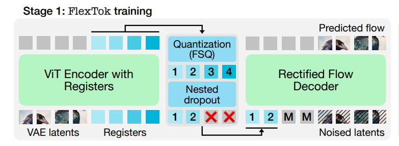
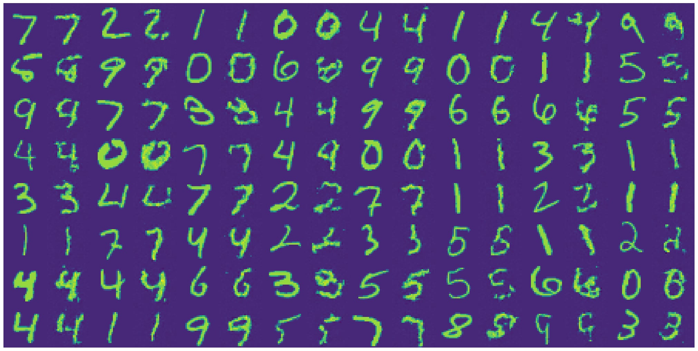

# Stage 1 of FlexTok

Current implementation covers stage 1 of FlexTok training

*Diagram from [the paper](https://arxiv.org/abs/2502.13967)*

Sample of reconstructed images from a model trained on a mnist dataset. First number is the original image, second is the reconstruction using all of the registers.

